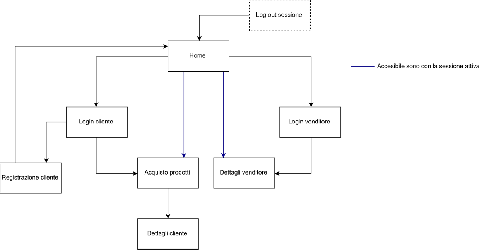

# Search & Buy

Project for: *Università degli Studi di Milano - Applicazioni web e cloud*

Gianluca Rubino

*AY 2018/2019*

## Website Presentation

The site allows customers to register to the platform and, once registered, perform certain operations. In the purchase page the customer is shown the available products in random order. The products can be filtered through the search bar; once chosen they can be added to the cart, which is on the same page. The customer can decide which products to add, the quantity and whether to remove a product in case he doesn't want to buy it anymore. He cannot add the same product more times to the cart. The products in the cart can be removed completely with the appropriate button, or they can be purchased. The purchased products, if recent enough, are shown in the customer details page.

In the details page a Customer can view the detailed information of his account and the purchases he has made recently. Of the recent purchases it is visible for each transaction: the date of purchase, the list of products, the quantity, the individual prices and the total price.
A seller already registered on the platform can view his details page where he can see: name, surname, type of business, phone number, VAT number and the products for sale on the platform. For each product he sells he can see: the name, the preview image, a short description, the selling price and the number of units left.
With each purchase made by a customer, the amount of units left decreases equal to the number of items bought. If the available units reach 0 the product can no longer be added to the cart.

If a customer is logged in to the site, he cannot log in as a seller and access his private area until he logs out of the customer session. Vice versa, a seller with an active session cannot access a customer's private area.

## Website structure

Starting from the home page, it is possible to choose whether to access as a customer or as a seller. Choosing "Buy products", in case a customer session is not active, the page redirects to the login session. From the log-in session it is possible to choose to register. Once registration is complete the page redirects to the home page with a confirmation feedback. The operations are similar from the seller with the difference that it is not possible to register. Once logged in, a rule valid for both types of users, from the home page it is possible to access directly to the reserved area, it is not possible to have a customer and seller session active at the same time. From the customer's side you can buy products and see your account details along with recent purchases. While on the seller's side you can see your account details and recent purchases.
Once you log out of the session, for any customer, the page redirects to the home page where you can log in with a different account, or simply end the use of the site. A customer's session is saved in session storage, so you can log in with different accounts on different browser windows. However, once you close a tab, the session is lost and you must log in again when you reconnect to the site.
Implementation choices
The JavaScript code is divided into three files. In the first, main.js, the main elements in the current page are taken and the methods needed to make it work are chosen.
The second is organized into five main objects with different goals. One contains methods for interacting with session storage, another contains methods for interacting with local storage; one deals with printing elements in web pages, another deals with executing functions when a button is pressed, often the functions are methods called by the previous classes. Finally, the last object takes care of redirecting the site to certain web pages when requested.
In the third one there are three arrays representing respectively: all customers, sellers and initial products to run the site. These arrays are loaded on the first startup, in the presence of an empty local storage, to allow the use of the site. Each array is a list of objects, each with attributes related to its nature.
The advantage of this subdivision is to have a compact list, accessible by macro-categories and readable. The disadvantage, instead, is the difficulty of access for a single object; since, once a macro-category has been chosen, access can only be sequential.

## How the required operations have been realized:

- Log-in
    - Both customers and vendors username and password have to match with an object in the respective array.
- Customer registration
    - All information marked by the user is collected in an object and added to the customer array.
- Active session
    - The active session is saved with all related information in the session storage. When needed it is taken to check the type of access and who has executed it.
- Vendor page
    - The vendor information is taken from the local storage and printed in html format. The active user whose details to print is in the session storage.
    - The list of products he sells is selected from the array of products with the same VAT number and printed in an html table.
- Purchase page - products
    - The list of products is printed in html format on the page from the array of products. For each product, a button is created to add it to the shopping cart. If the product is no longer available the button is not clickable.
- Purchase page - search
    - The search bar can filter the products on the basis of attributes that correspond with some present in the product object (name, description/characteristics, price).
- Purchase page - shopping cart management
    - An object added to the cart is formatted in such a way that it is printed in the cart html table. The cart total is calculated every time a product is added, removed or its quantity is changed. Products are also saved in session storage to be maintained even if the page is reloaded. Once the purchase is made, all the transaction information is saved in the local storage with a dedicated key. Each transaction saved in the local storage is easily accessible by its unique key and can belong to different users.
- Customer Information
    - Customer details are taken from the local storage and formatted for the html page. The customer corresponding to the one who logged in is taken. Recent purchases are taken from local storage and formatted in an html table to be printed on the page. They too must have been purchased by the active client in the session.

